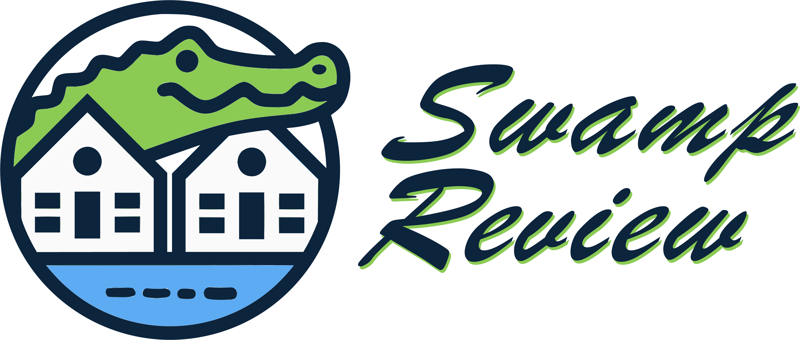

# Swamp Review

A student-built web application designed to help University of Florida students find the best on-campus housing options. Whether you're an incoming freshman or a returning student, this site offers an intuitive way to browse and filter dormitories based on type, location, accommodations, and more.

## Features

- Comprehensive housing database with filtering by type, area, and amenities
- Review tagging system for easy navigation and insights
- Points of Interest and Google Maps integration for added location context
- Multiple ratings categories (e.g., cleanliness, quietness, amenities)
- Content moderation to ensure reliable and respectful reviews
- Dark and light mode themes for comfortable browsing
- Built-in content moderation for secure and helpful feedback

## Technology Stack

This project uses modern web development tools to ensure speed, scalability, and maintainability:

- **Frontend:** React.js, Material UI Joy, Tailwind CSS
- **Backend:** Supabase for database and authentication
- **Testing:** pgTap for database testing, Vitest for frontend testing
- **Documentation:** JSDoc for typesetting
- **Code Quality:** ESLint for code consistency
- **Build Tool:** Vite for optimized development and production builds

## Installation

Clone the repository and install the dependencies with npm:

```bash
git clone https://github.com/Code-Goblins2024/swamp-review
cd swamp-review
npm install
```

## Deployment

To deploy this project, run:

```bash
npm run deploy
```

## Running Tests

To run the tests, use the following command:

```bash
npm run test
```

```bash
npx supabase test db --db-url "DB_URL"
```

This command will run unit tests and database tests using Vitest and pgTap.

## Authors

- [Jordan Sheehan](https://github.com/sheehan-j)
- [Micheal Pangas](https://github.com/mpangas)
- [Evan Robinson](https://github.com/erobx)
- [Vance Boudreau](https://github.com/VBoudreau55)

## Support

For support or questions, feel free to leave issues. 

## License

MIT License

Copyright (c) 2024 Code Goblins

Permission is hereby granted, free of charge, to any person obtaining a copy
of this software and associated documentation files (the "Software"), to deal
in the Software without restriction, including without limitation the rights
to use, copy, modify, merge, publish, distribute, sublicense, and/or sell
copies of the Software, and to permit persons to whom the Software is
furnished to do so, subject to the following conditions:

The above copyright notice and this permission notice shall be included in all
copies or substantial portions of the Software.

THE SOFTWARE IS PROVIDED "AS IS", WITHOUT WARRANTY OF ANY KIND, EXPRESS OR
IMPLIED, INCLUDING BUT NOT LIMITED TO THE WARRANTIES OF MERCHANTABILITY,
FITNESS FOR A PARTICULAR PURPOSE AND NONINFRINGEMENT. IN NO EVENT SHALL THE
AUTHORS OR COPYRIGHT HOLDERS BE LIABLE FOR ANY CLAIM, DAMAGES OR OTHER
LIABILITY, WHETHER IN AN ACTION OF CONTRACT, TORT OR OTHERWISE, ARISING FROM,
OUT OF OR IN CONNECTION WITH THE SOFTWARE OR THE USE OR OTHER DEALINGS IN THE
SOFTWARE.
